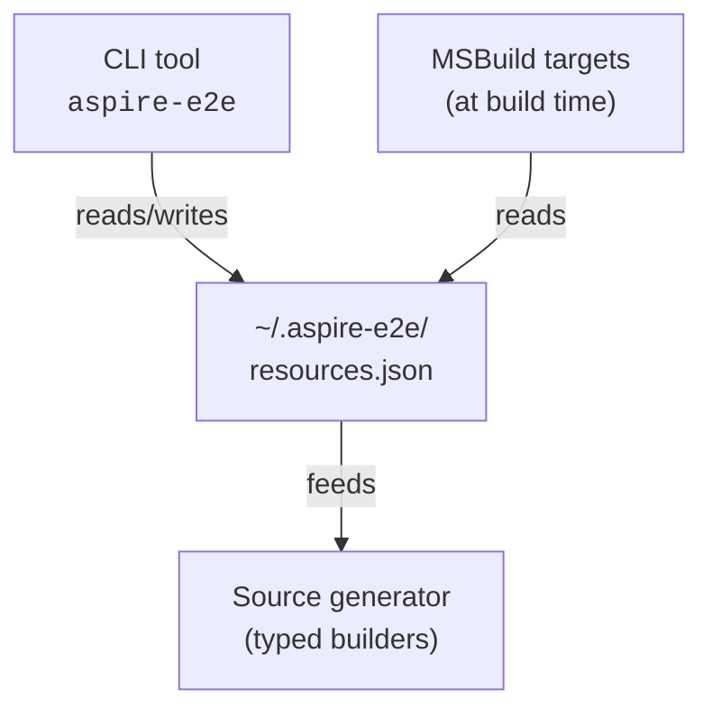

# Aspire E2E

[](https://www.nuget.org/packages/Shirubasoft.Aspire.E2E.Hosting)
[](https://github.com/shirubasoft/aspire-e2e/actions/workflows/build.yml)
[](LICENSE)

Share .NET Aspire services across multiple repositories. A service runs as a **Project** in its home repo and as a **Container** everywhere else — with a single declaration.

## The Problem

In a multi-repo setup, you want `payments-service` to:

- Run as a **Project** in the `payments` repo (for inner-loop development with hot reload, debugging, etc.)
- Run as a **Container** in the `frontend` repo (consuming it as a dependency)

Aspire has no built-in way to do this. You'd need to maintain separate AppHost configurations, manually build container images, and keep them in sync.

## How It Works

Aspire E2E introduces a `SharedResourceReference` MSBuild item and a global configuration file (`~/.aspire-e2e/resources.json`) that tracks how each shared service should run. A Roslyn source generator creates type-safe builders at compile time, and MSBuild targets handle container image builds automatically.



## Packages

| Package | Description |
|---------|-------------|
| [`Shirubasoft.Aspire.E2E`](https://www.nuget.org/packages/Shirubasoft.Aspire.E2E) | MSBuild targets to enable container support on service projects |
| [`Shirubasoft.Aspire.E2E.Hosting`](https://www.nuget.org/packages/Shirubasoft.Aspire.E2E.Hosting) | Runtime types, MSBuild targets, and source generator for AppHost projects |
| [`Shirubasoft.Aspire.E2E.Cli`](https://www.nuget.org/packages/Shirubasoft.Aspire.E2E.Cli) | Global CLI tool for managing shared resources |

## Getting Started

### 1. Install the CLI tool

```bash
dotnet tool install -g Shirubasoft.Aspire.E2E.Cli
```

### 2. Add container support to your service project

In the service project you want to share (e.g., `payments-service.csproj`):

```bash
dotnet add package Shirubasoft.Aspire.E2E
```

This enables `dotnet publish` to produce a container image for the project.

### 3. Register the service

Use the CLI to discover and register the service:

```bash
aspire-e2e search /path/to/payments-repo
```

This finds projects referencing `Shirubasoft.Aspire.E2E` and adds them to your global config. You can then configure each resource:

```bash
aspire-e2e update payments-service
```

### 4. Reference the shared service in your AppHost

Add the hosting package to your consuming AppHost project:

```bash
dotnet add package Shirubasoft.Aspire.E2E.Hosting
```

Then declare the shared resource in the `.csproj`:

```xml
<ItemGroup>
  <SharedResourceReference Include="payments-service">
    <Name>PaymentsService</Name>
  </SharedResourceReference>
</ItemGroup>
```

### 5. Use in your AppHost code

```csharp
var builder = DistributedApplication.CreateBuilder(args);

builder.Configuration.AddGlobalResourceConfiguration();

var payments = builder.AddPaymentsService()
    .ConfigureProject(project => project
        .WithHttpHealthCheck("/health"))
    .ConfigureContainer(container => container
        .WithHttpEndpoint(targetPort: 8080)
        .WithHttpHealthCheck("/health"));

builder.Build().Run();
```

The `AddPaymentsService()` method is generated at compile time by the source generator. `ConfigureProject` and `ConfigureContainer` only execute their callbacks when the resource is in the matching mode.

## Use Cases

### Multi-repo microservices

A team owns `orders-service` in its own repo. Other teams reference it in their AppHosts as a container. The orders team runs it as a project for development:

```bash
# In orders repo — set mode to Project
aspire-e2e update orders-service --mode Project

# In frontend repo — set mode to Container
aspire-e2e update orders-service --mode Container
```

### CI/CD container builds

The CLI can build container images with git-aware tagging:

```bash
aspire-e2e build payments-service
```

This runs the configured build command, tags the image with the current git branch and commit hash, and updates the global config with the new tag.

### Switching modes during development

Temporarily switch a dependency to project mode for debugging, then switch back:

```bash
aspire-e2e update payments-service --mode Project --project-path /path/to/payments.csproj
# ... debug the issue ...
aspire-e2e update payments-service --mode Container
```

### Skip image builds for faster iteration

When iterating on your own service, skip rebuilding container images for dependencies:

```bash
aspire-e2e update orders-service --build-image false
```

## CLI Commands

| Command | Description |
|---------|-------------|
| `aspire-e2e search [path]` | Find projects referencing the E2E package |
| `aspire-e2e list` | Show all registered resources |
| `aspire-e2e update <id>` | Update a resource configuration |
| `aspire-e2e remove <id>` | Remove a resource |
| `aspire-e2e build <id>` | Build a container image with git tagging |
| `aspire-e2e get-mode <id>` | Get the current mode (machine-readable) |
| `aspire-e2e get-project-path <id>` | Get the project path (machine-readable) |
| `aspire-e2e get-config <id> <key>` | Get a config value (machine-readable) |
| `aspire-e2e modes` | Interactively toggle Project/Container mode for resources |
| `aspire-e2e import [path]` | Import resources from an `e2e-resources.json` file |
| `aspire-e2e clear` | Delete all resources from the global configuration |
| `aspire-e2e override set <key> <value>` | Set a global override (`Mode` or `BuildImage`, case-insensitive) |
| `aspire-e2e override set-registry <from> <to>` | Add an image registry rewrite rule |
| `aspire-e2e override set-image <from> <to>` | Add an image rewrite rule (e.g. `rabbitmq:4-management` → `rabbitmq:4`) |
| `aspire-e2e override remove <key>` | Remove a global override (case-insensitive key) |
| `aspire-e2e override remove-registry <from>` | Remove a registry rewrite rule |
| `aspire-e2e override remove-image <from>` | Remove an image rewrite rule |
| `aspire-e2e override list` | Show current overrides |
| `aspire-e2e override clear` | Remove all overrides |

## Configuration

Resources are stored in `~/.aspire-e2e/resources.json`:

```json
{
  "Aspire": {
    "Overrides": {
      "Mode": "Container",
      "BuildImage": false,
      "ImageRegistryRewrites": {
        "docker.io": "ghcr.io/myorg"
      },
      "ImageRewrites": {
        "rabbitmq:4-management": "rabbitmq:4"
      }
    },
    "Resources": {
      "payments-service": {
        "Id": "payments-service",
        "Name": "PaymentsService",
        "Mode": "Container",
        "ProjectPath": "/path/to/payments-service.csproj",
        "ContainerImage": "payments-service",
        "ContainerTag": "main-abc1234",
        "BuildImage": true,
        "BuildImageCommand": "dotnet publish --os linux --arch x64 /t:PublishContainer",
        "ImageRegistry": "ghcr.io/myorg"
      }
    }
  }
}
```

### Overrides

The `Overrides` section applies values to **all** resources at load time without modifying the saved configuration. This is useful for switching every resource to container mode in CI, or rewriting image registries across environments.

- **`Mode`** — overrides the `Mode` on every resource
- **`BuildImage`** — overrides `BuildImage` on every resource
- **`ImageRegistryRewrites`** — dictionary of `from → to` rewrites applied to each resource's `ImageRegistry`
- **`ImageRewrites`** — dictionary of `from → to` rewrites applied to each resource's full image (`ContainerImage:ContainerTag`). For example, `"rabbitmq:4-management": "rabbitmq:4"` rewrites any resource with that exact image and tag.

Override keys in CLI commands (`set`, `remove`) are case-insensitive.

Overrides can also be set in a local `e2e-resources.json` file. Local overrides merge on top of global overrides.
```

## Requirements

- .NET 10.0 or later
- .NET Aspire 13.1 or later
- Docker or Podman (for container mode)

## Contributing

Contributions are welcome. Please open an issue first to discuss what you'd like to change.

## License

[MIT](LICENSE)
